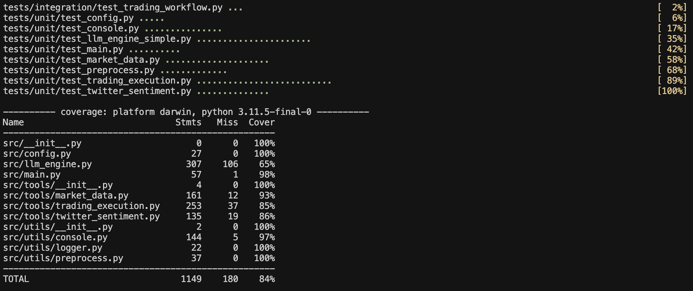

# LLM-Powered Trading Agent

An LLM-driven trading agent that interacts with Hyperliquid to execute trades based on various tools. The LLM acts as the central decision-making engine, dynamically selecting tools based on user context and need.

## Key Features

- **Advanced LLM Agent Architecture**: Uses OpenAI's function calling to intelligently select and execute the right tools at the right time.
- **Dynamic Tool Selection**: LLM dynamically decides which tools to use based on the specific context and requirements.
- **Modular Tools System**: Tools like Twitter sentiment analysis, market data fetcher, and trade execution provide insights and actions.
- **Fully Agent-Driven**: The LLM maintains state and chains multiple tools together to achieve the user's goals.
- **Hyperliquid Trading Execution**: Executes trades programmatically on the Hyperliquid Testnet.

## Architecture

The project follows a modern AI agent architecture with the following components:

- **LLM Engine**: Core agent that dynamically decides which tools to call based on context.
- **Tool Specification System**: Automatically generates OpenAI function descriptions from tool classes.
- **Tools**: Modular components for data collection, analysis, and execution (tools can be added with ease):
  - Market Data: Fetches live trading data from Hyperliquid.
  - Decision: Makes a final LONG/SHORT recommendation.
  - Trading Execution: Executes trades on Hyperliquid with risk management.


## Setup & Installation

1. **Clone Repo**
   ```bash
   git clone https://github.com/ribhav99/spectral_agent.git
   cd spectral_agent
   ```

2. **Install Dependencies in Virtual Environment**
   ```bash
   python -m venv venv
   source venv/bin/activate
   pip install uv
   uv pip install -r requirements.txt
   ```

3. **Set Up API Keys**
   Create a `.env` file in the root directory with your API keys by copying the .env.example file.


4. **Run the Agent**
   ```bash
   # Run in interactive mode
   python -m src.main --interactive
   
   # Run with specific parameters
   python -m src.main --prompt "trade using sentiment" --symbol ETH --amount 10 --dry-run 
   ```

## Example Usage

```bash
# Analyze sentiment without executing trade
python -m src.main --prompt "analyze sentiment for BTC" --symbol BTC --dry-run

# Trade based on market data for ETH (will execute if not in dry-run mode)
python -m src.main --prompt "execute a trade based on price action" --symbol ETH --dry-run

# Comprehensive analysis and trading for SOL
python -m src.main --prompt "analyze the market and execute a trade if conditions are favorable" --symbol SOL --dry-run

# Run in interactive mode
python -m src.main --interactive
```

## Agent Workflow

1. **User Input**: User provides a natural language request
2. **LLM Analysis**: LLM analyzes the request and determines which tools to call and in what order
3. **Dynamic Tool Execution**: LLM executes a sequence of tools, using the output of one tool as input to another
   - For example: Market Data → Decision Tree → Decision → Trading Execution
4. **Contextual Decision Making**: LLM maintains context throughout the interaction, making informed decisions at each step
5. **Results**: The final results (analysis or trade execution) are returned to the user

## Technical Implementation

The agent uses OpenAI's function calling API to implement the following pattern:

1. **Tool Discovery**: Automatically extracts tool parameters and descriptions from Python classes
2. **Tool Selection**: LLM selects the appropriate tool based on context and user request
3. **Tool Execution**: The system executes the tools and feeds results back to the LLM
4. **Chained Reasoning**: LLM maintains context across multiple tool calls to achieve the user's goal

## Disclaimer

This project is for fun and to demonstrate my work to Spectral. Do not use this for trading.

## Future Work

1. Add more tools to allow users to use numerous trading strategies.
2. Make the agent stay online so it can high frequency trade. There will be non trivial cost implications for model inference.
3. Create a tool to gather coins/securities to do more research on.
4. Mutiple agents can either work on multiple coins at the same time or use different tools to evaluate the same coin at the same time to allow for higher frequency trading.
5. Creating intermediate models to ingest numeric data and output language data instead of hacing the LLM make sense of it directly to prevent hallucinations and reasoning errors.


# Spectral Agent Test Suite

The tests directory contains comprehensive tests for the Spectral Agent trading application. The tests are organized into different categories to validate the functionality of each component independently as well as the integrated workflow.

## Test Structure

- **Unit Tests**: Test individual components in isolation
  - `test_twitter_sentiment.py`: Tests for the Twitter sentiment analysis tool
  - `test_market_data.py`: Tests for the market data collection tool 
  - `test_trading_execution.py`: Tests for the trading execution tool

- **Integration Tests**: Test components working together
  - `test_trading_workflow.py`: Tests the complete workflow from sentiment analysis to trade execution

## Running the Tests



### Prerequisites

- Python 3.9+
- pytest (`pip install pytest`)
- pytest-cov (for coverage reporting: `pip install pytest-cov mock`)
- All dependencies installed (see main project requirements.txt)


### Using the Provided Test Runner

The easiest way to run tests is with the included test runner script:

```bash

# Run all tests
./tests/run_tests.py

# Run tests with verbose output
./tests/run_tests.py --verbose

# Run only unit tests
./tests/run_tests.py --unit

# Run with coverage report
./tests/run_tests.py --coverage

# Run specific tests
./tests/run_tests.py --tests twitter_sentiment
```

#### Running Specific Test Categories

```bash
# Unit tests
pytest tests/unit/

# Integration tests
pytest tests/integration/
```
