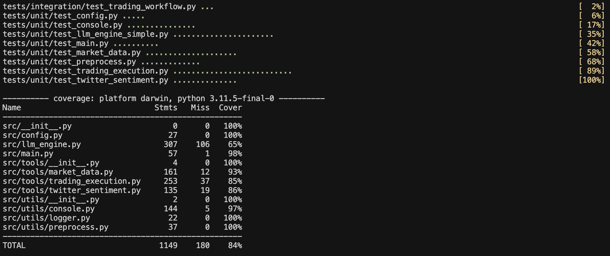

# 🤖 LLM-Powered Trading Agent

## Link to demo: https://youtu.be/NBHp1SBxw9c

An LLM-driven trading agent that interacts with Hyperliquid to execute trades. The LLM acts as the central decision-making engine, dynamically selecting tools based on user context.

## ✨ Key Features

- **🧠 Advanced LLM Agent Architecture**: Uses OpenAI's function calling to select and execute the right tools at the right time.
- **🔄 Dynamic Tool Selection**: LLM dynamically decides which tools to use based on the specific context and requirements.
- **🧰 Modular Tools System**: Tools such as Twitter sentiment analysis, market data fetcher, and trade execution provide insights and actions.
- **🤝 Fully Agent-Driven**: The LLM maintains state and chains multiple tools together to achieve the user's goals.
- **📈 Hyperliquid Trading Execution**: Executes trades programmatically on the Hyperliquid Mainnet.

## 🏗️ Architecture

The project follows a modern AI agent architecture with the following components:

- **🧠 LLM Engine**: Core agent that dynamically decides which tools to call based on context.
- **📝 Tool Specification System**: Automatically generates OpenAI function descriptions from tool classes.
- **🧰 Tools**: Modular components for data collection, analysis, and execution (tools can be added with ease):
  - 📊 Market Data: Fetches live trading data from Hyperliquid.
  - 🔍 Decision: Makes a final LONG/SHORT execution.
  - 💸 Trading Execution: Executes trades on Hyperliquid with risk management in mind.


## 🚀 Setup & Installation

1. **📥 Clone Repo**
   ```bash
   git clone https://github.com/ribhav99/spectral_agent.git
   cd spectral_agent
   ```

2. **📦 Install Dependencies in Virtual Environment**
   ```bash
   python -m venv venv
   source venv/bin/activate
   pip install uv
   uv pip install -r requirements.txt
   ```

3. **🔑 Set Up API Keys**
   Create a `.env` file in the root directory with your API keys by copying the .env.example file.
   ```bash
   cp .env.example .env
   ```


4. **▶️ Run the Agent**
   ```bash
   # Run in interactive mode
   python -m src.main --interactive
   
   # Run with specific parameters
   python -m src.main --prompt "trade using sentiment" --symbol ETH --amount 10 --dry-run 
   ```

## 💡 Example Dry Run

Run without the `--dry-run` flag to actually execute the trade.

```bash
# Analyze sentiment without executing trade
python -m src.main --prompt "analyze sentiment for BTC" --symbol BTC --dry-run

# Trade based on market data for ETH (will execute if not in dry-run mode)
python -m src.main --prompt "execute a trade based on price action" --symbol ETH --dry-run

# Comprehensive analysis and trading for SOL
python -m src.main --prompt "analyze the market and execute a trade if conditions are favorable" --symbol SOL --dry-run

# Run in interactive mode
python -m src.main --interactive
```

## Build with Docker Instead: 

```bash
docker build -t spectral-agent .
```


### Run with Docker after building:
```bash
docker run -it --rm spectral-agent
```


### Dry run for BTC:

```bash
docker run -it --rm spectral-agent \
  python -m src.main --prompt "analyze sentiment for BTC" --symbol BTC --dry-run
```

## 🔄 Agent Workflow

1. **📝 User Input**: User provides a natural language request
2. **🧠 LLM Analysis**: LLM analyzes the request and determines which tools to call and in what order
3. **⚙️ Dynamic Tool Execution**: LLM executes a sequence of tools, using the output of one tool as input to another
   - For example: Market Data → Twitter Sentiment Analysis → Decision → Trading Execution
4. **🧩 Contextual Decision Making**: LLM maintains context throughout the interaction, making informed decisions at each step
5. **📊 Results**: The final results (analysis or trade execution) are returned to the user

## 🔧 Technical Implementation

The agent uses OpenAI's function calling API to implement the following pattern:

1. **🔍 Tool Discovery**: Automatically extracts tool parameters and descriptions from Python classes
2. **🎯 Tool Selection**: LLM selects the appropriate tool based on context and user request
3. **⚙️ Tool Execution**: The system executes the tools and feeds results back to the LLM
4. **🔄 Chained Reasoning**: LLM maintains context across multiple tool calls to achieve the user's goal

## ⚠️ Disclaimer

This project is for fun and to demonstrate my work to Spectral. Do not use this for trading.

## 🔮 Future Work

1. **🧰 Enhanced Tool Ecosystem**: Add more specialized trading tools like technical analysis, fundamental analysis, and on-chain metrics.
2. **🔄 Real-time Agent Monitoring**: Implement a persistent agent that can monitor markets 24/7 with cost-efficient model inference (recent research on diffusion based LLMs).
3. **🔍 Multi-Asset Research**: Create tools to identify promising assets for investigation based on volume, volatility, and other metrics.
4. **👥 Multi-Agent Collaboration**: Deploy multiple agents that can either work on different assets in parallel or analyze the same asset using different methodologies for high frequency trading.
5. **🧮 Intermediate Models for Data Processing**: Develop specialized models to process numeric data before LLM evaluation to reduce hallucinations and improve reasoning.
6. **🛡️ Advanced Risk Management**: Implement more sophisticated risk management tools including position sizing, stop-loss strategies, and portfolio balancing.
7. **📊 Performance Analytics**: Add tools to track and analyze trading performance over time with detailed metrics and visualizations.
8. **⏱️ Backtesting Framework**: Create a framework to backtest trading strategies with historical data before deploying them live.
9. **🔄 Re-inforcement Learning Framework**: Given that portfolio performance is verifiable, create a pipeline where the model learn from it's own performance.


# 🧪 Spectral Agent Test Suite

The tests directory contains tests for the Spectral Agent trading application. 

## 📚 Test Structure



- **🔬 Unit Tests**: Test individual components in isolation
  - `test_twitter_sentiment.py`: Tests for the Twitter sentiment analysis tool
  - `test_market_data.py`: Tests for the market data collection tool 
  - `test_trading_execution.py`: Tests for the trading execution tool
  - `test_config.py`: Tests for configuration management
  - `test_console.py`: Tests for console input/output utilities
  - `test_preprocess.py`: Tests for data preprocessing functions
  - `test_main.py`: Tests for the main application entry point
  - `test_llm_engine_simple.py`: Tests for the LLM engine core functionality

- **🔗 Integration Tests**: Test components working together
  - `test_trading_workflow.py`: Tests the complete workflow from sentiment analysis to trade execution

## 📊 Test Coverage

The test suite achieves 84% overall code coverage with most modules reaching 85-100% coverage:

- ⚙️ Configuration module: 100%
- 🛠️ Utilities (preprocess, logger): 100% 
- 💻 Console handling: 97%
- 🚀 Main application: 98%
- 📈 Market data tool: 93%
- 💸 Trading execution: 85%
- 🐦 Twitter sentiment: 86%
- 🧠 LLM engine: 65%


### 📋 Prerequisites

- Python 3.9+
- pytest (`pip install pytest`)
- pytest-cov (for coverage reporting: `pip install pytest-cov mock`)
- All dependencies installed (see main project requirements.txt)


### ▶️ Using the Provided Test Runner

The easiest way to run tests is with the included test runner script:

```bash
# Run all tests
./tests/run_tests.py

# Run tests with verbose output
./tests/run_tests.py --verbose

# Run only unit tests
./tests/run_tests.py --unit

# Run with coverage report
./tests/run_tests.py --coverage

# Run specific tests
./tests/run_tests.py --tests twitter_sentiment
```

#### 🔍 Running Specific Test Categories

```bash
# Unit tests
pytest tests/unit/

# Integration tests
pytest tests/integration/

# Run tests with coverage report
pytest --cov=src tests/ --cov-report term
```

## Contact
Ribhav Kapur - ribhav.kapur99@gmail.com
